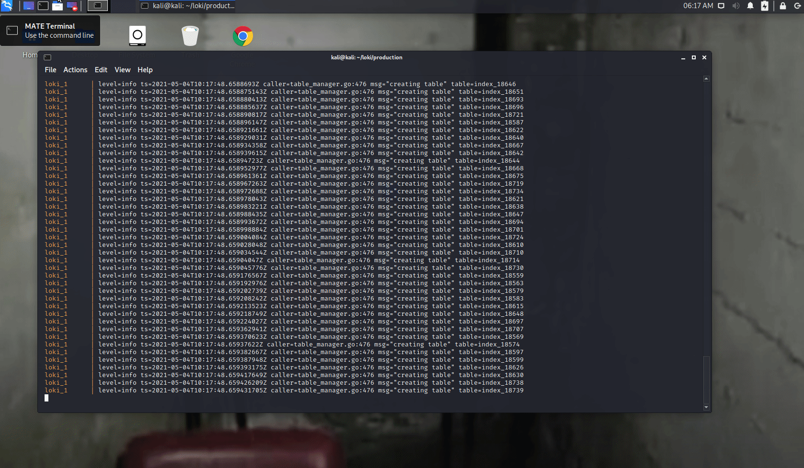

# Grafana Loki - szybciutki start

W celu szybkiego zainstalowania Grafany z Loki, musisz mieć [`gita`](https://git-scm.com/book/en/v2/Getting-Started-Installing-Git) oraz [`docker-compose`](https://docs.docker.com/compose/install/) zainstalowanego na swojej maszynie. Możesz też skorzystać z innych dostępnych metod na oficjalnej [stronie Grafany](https://grafana.com/docs/loki/latest/installation/).

## Instalacja
Najpierw ściągnij repozytorium Loki z ich oficjalnego githuba:
```sh
git clone https://github.com/grafana/loki.git
```
Następnie zmień scieżkę na produkcyjną, która zawiera pliki yamal docker-compose.
```sh
cd loki/production
```
Pobierz obrazy:
```sh
docker-compose pull
```
Uruchom instancję:
```sh
docker-compose up
```
## Konfiguracja
1) Jeżeli pomyślnie udało Ci się zainstalować, przejdź do przeglądarki odpalając Grafanę na swoim hoście:
[`http://localhost:3000`](http://localhost:3000)

2) Następnie zaloguj się używając login `admin` i hasło `admin`. 

3) Po zalogowaniu, najedź na ikonkę kół zębatych ⚙️ i kliknij `Data Sources`.
Teraz możesz wybrać typy danych, które chcesz dodać do Grafany.

4) Wybieramy `Add data source` a następnie znajdujemy i klikamy w pozycję `Loki`.

5) Będąc na stronie konfiguracji musimy dodać URL serwera loki, który aktualnie jest na naszym hości. 
Wpisujemy więc `http://loki:3100` i klikamy `Save and Test`.



## Eksploracja

## Źródła
Powyższa instrukcja została zainspirowana następującymi źródłami:
1) ▶️ [Getting started with Grafana Loki - under 4 minutes](https://www.youtube.com/watch?v=1obKa6UhlkY)
2) 📰 [Grafana Loki Intro](https://geekflare.com/grafana-loki-intro/)
3) 📰 [Open source centralized logging](https://geekflare.com/open-source-centralized-logging/)
4) 📰 [Another link to verify](https://opensource.com/article/18/9/open-source-log-aggregation-tools)
5) 📰 [Oficial github](https://github.com/grafana/loki)
